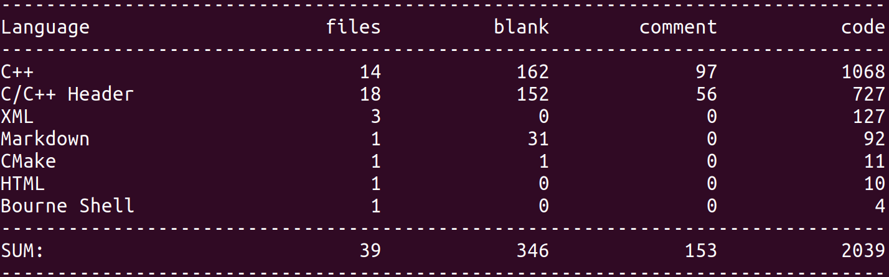
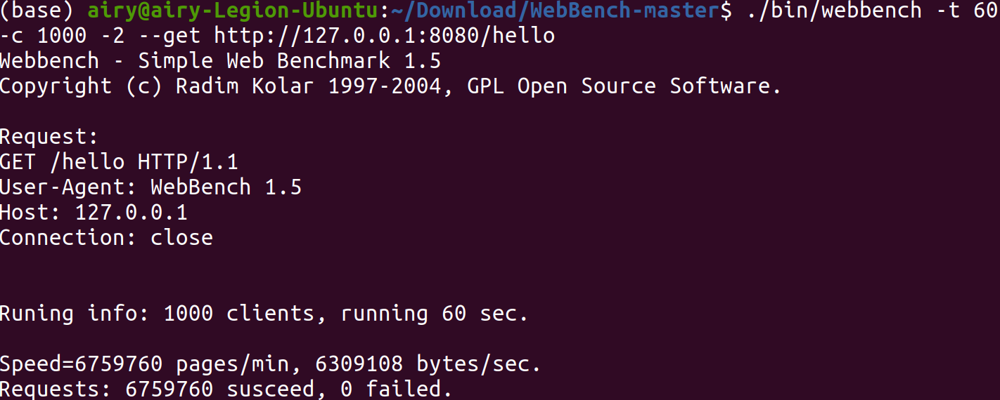
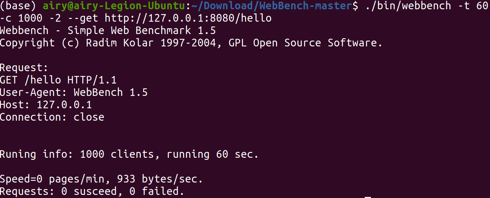
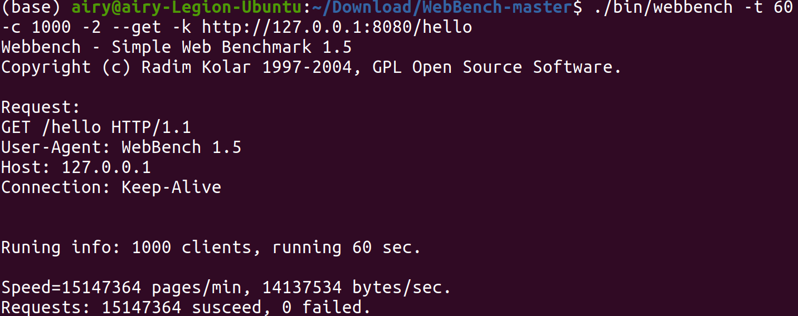
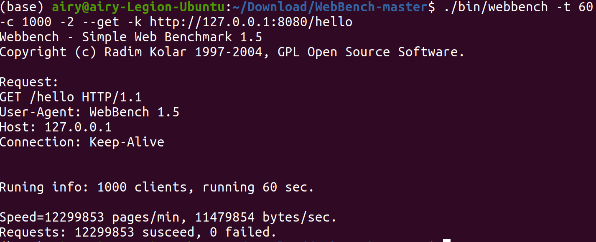

C++ Web Server

## Introduction

本项目为C++11编写的Web服务器，解析了GET、HEAD请求，能处理静态资源，支持HTTP长连接，实现了异步日志。

实现上参考了[项目https://github.com/linyacool/WebServer](https://github.com/linyacool/WebServer)、《Linux高性能服务器编程》和《Linux多线程服务端编程》。

## Environment

- OS: Ubuntu 20.04
- Compiler: g++ 9.3, cmake 3.16

## Build

`./build.sh`

在build目录下可以找到WebServer可执行文件。

## Usage

```
cd build
./WebServer [-t thread_nums] [-p listen port] [-l log_file_path(absolute path)]
```

## Technical points

- 使用Epoll边沿触发的IO多路复用，使用Reactor模式
- 设计了线程和线程池模板类，用来包裹处理网络服务的类
  - 主线程负责建立连接，建立的连接以Round Robin的形式分发给线程池中的工作线程
- 设计了基于小根堆和map的定时器，用于关闭长时间无响应的长连接和短连接
  - 小根堆记录可能的超时时间，map中记录准确的超时时间，小根堆中弹出的超时任务从map中查询准确的超时时间，如果没有超时，则任务更新超时时间后再次入堆
  - 长连接情况下，新的请求可以刷新定时器中的超时事件
- 使用eventfd实现线程的异步唤醒，防止长时间阻塞在epoll_wait中
- 使用双缓冲技术实现异步日志
- 使用状态机解析HTTP请求

## 实现

- Channel

  - 除了建立新的连接用的Channel，别的Channel都用来处理HTTP请求
  - 通过给Channel绑定不同的处理函数，让其能处理不同的事件

- HttpEvent

  - 处理HTTP请求的类，用有限状态机解析HTTP请求
  - HttpEvent和Channel一一对应，HttpEvent处理的结果会导致Channel
    - 删除
    - 更改监听事件
    - 不做处理
  - 在解析HTTP请求的过程中，判断连接是否是长连接

- Epoll

  - 管理epoll的类，可以
    - 将Channel的描述符和监听事件添加/删除/修改
    - 返回有事件发生的Channel

- EventLoop

  - 内部有一个Epoll实例，一个等待队列，一个时间堆，是主要工作类，每个线程有一个EventLoop对象，该对象一直循环。
  - 每次loop，调用Epoll实例的poll，得到需要处理的Channel数组，调用这些Channel的回调函数handleEvent，这个回调函数会根据epoll监听到的事件来选择处理方式并决定是否从Epoll中删除Channel
  - 处理完所有poll的Channel后，处理等待队列，首先加锁，用交换得到需要处理的等待队列Channel，然后调用这些Channel的回调函数handleConnection，可以将Channel加到Epoll中，如果设置有超时事件，则同时加到时间堆中

  - 处理完等待队列后，处理超时任务，首先加锁，用交换获得时间堆，调用这些Channel的回调函数handleClose，并主动从Epoll中删除这些Channel

- Server

  - server是服务器的主要入口

    - start时，会首先建立一个连接用的channel，channel设置监听，绑定连接回调`bind(Server::newConnection, this)`，每来一个新的连接，则从线程池中选一个EventLoop，将新的连接加到EventLoop的等待队列中，加新的连接时，主动唤醒EventLoop，防止在epoll中等待过长。

- ThreadPool
  - 以模板类的形式实现，主线程和工作线程可以绑定不同的类
  - Thread里用`unique_ptr`管理一个Event指针
  - Thread重载了`->`和`*`，可以用`thread->eventFunc()`的形式调用
  - ThreadPool包含一个MainEvent，和threadNums个Thread


- logger
  - 分成五个相关类，FileUtil，LogFile，AsyncLogging，LogStream和Logging
  - FileUtil
    - RAII，销毁时释放句柄
    - 写文件的基本操作，分配一定大小的缓冲区，缓冲区填满后调用一次系统调用
    - append，向文件末尾写入数据
    - write，真正写入数据的函数
  - LogFile
    - RAII，根据文件名，建立FileUtil实例
    - 对FileUtil的进一步封装，也是多个线程能竞争的地方，所以需要有mutex变量，在写文件操作时，先用LockGuard保护
    - append，调用FileUtil向文件末尾写入数据
    - append调用一定次数后，执行一次flush
  - AsyncLogging
    - 使用双缓冲技术
      - 前端向缓冲区写数据，后端将缓冲区的数据写到文件里，后端写缓冲区有两种可能，一是前端缓冲区写满，而是过了固定的时间
      - 前端有两块缓存，一块写满后，将另一块替换成记录数据的缓冲区，写满的缓冲区放到缓冲队列中
      - 前端的代码由执行任务的线程调用
      - 将缓冲队列交换到后端待写队列，唤醒后端，让后端将缓冲区的数据写到文件里
      - 后端有两块缓存，当前端唤醒后端后，将后端的缓存替换给前端的备用缓存
      - 后端代码由log线程调用
    - 缓冲区用RAII的形式，提供判断剩余空间大小等计算方式
    - 内部持有LogFile实例，用来将缓冲区里的数据写到文件里
    - 继承线程基类，让Thread类能包装AsyncLogging，使文件IO在独立的线程运行
  - LogStream
    - 重载`<<`，以c++ stream的形式记录日志
    - 设计成c++ `cout`和`endl`的使用风格
      - log时，一直向buffer中写数据
      - `log_endl`时，将buffer中的数据输出
      - 设计了`log_endl`和`log_tab`两个函数，用来输出换行和制表符，重载`<<`，使`<<`在接收`log_endl`时，能运行endl函数
    - LogStream本身拥有一个buffer，可以在打log的时候暂存信息，最后将完整的log信息一次写入后端
  - Logger
    - 是对外的接口
    - log文件名，写入间隔，调用源文件名，调用行号
    - log格式`日期 时间 内容 源文件名:行号`
    - Log定义为设置Logger的当前调用文件和行号，输出在log记录之前的信息，如日期和时间，返回stream对象
    - 本来想设计成单例模式，在服务器运行最开始创建一个logger实例，在写log的时候传入文件名和行号等信息，用的LogStream是同一个。后来发现这种写法在多个线程写log的时候存在竞争，需要再加一个锁。最后还是按照muduo的方法，每次打log的时候创建一个Logger类，绑定Logger类的output函数为AsyncLogging实例的append函数，在Logger析构的时候，调用AsyncLogging实例的append函数
- Timer

  - 包含一个最小堆和一个map，最小堆记录可能的超时时间，map里记录真实的超时时间，长连接每次新的请求时，更新map中记录的时间，小根堆中弹出的超时任务从map中查询准确的超时时间，如果没有超时，则任务更新超时时间后再次入堆
  - TimeNode和Channel互相引用（weak_ptr），如果Channel主动终止，则可以主动释放TimeNode中引用的Channel，及时释放资源


## 代码统计



## 测试

使用WebBench，使用4线程，关闭所有输出和log，与https://github.com/linyacool/WebServer项目对比

|  服务器  | 短连接QPS  | 长连接QPS |
| :------: | :--------: | :-------: |
|  此项目  |   112662   |  252456   |
| 参考项目 | 运行出问题 |  204997   |

- 此项目短连接测试

- 参考项目短连接测试可能没有主动关闭连接，webbench的测试结果是0succeed，0failed
- 此项目长连接测试

- 参考项目长连接测试